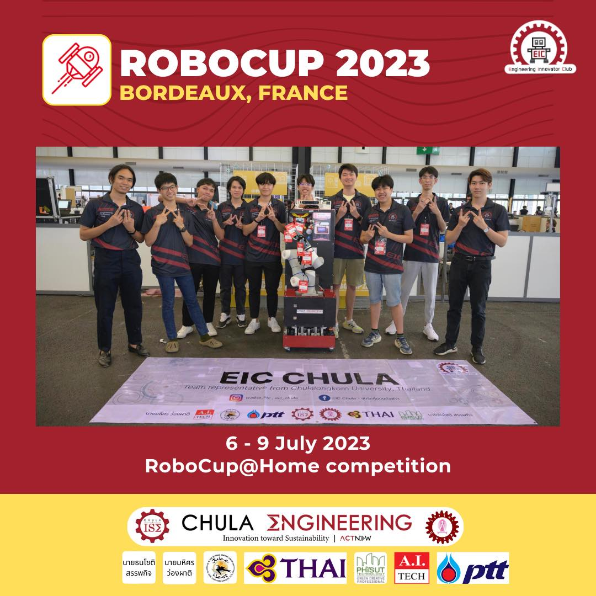

<!-- Improved compatibility of back to top link: See: https://github.com/othneildrew/Best-README-Template/pull/73 -->

<a name="readme-top"></a>

<!-- PROJECT LOGO -->
<!-- <br />
<div align="center">
  <a href="https://github.com/othneildrew/Best-README-Template">
    
  </a>

  <h3 align="center">Robocup2025-NLP</h3>

  <p align="center">
    A network of NLP services for Robocup2025

  </p>
</div> -->

<!-- TABLE OF CONTENTS -->
<details>
  <summary>Table of Contents</summary>
  <ol>
    <li>
      <a href="#about-the-project">About The Project</a>
      <ul>
        <li><a href="#built-with">Built With</a></li>
      </ul>
    </li>
    <li>
      <a href="#getting-started">Getting Started</a>
      <ul>
        <li><a href="#prerequisites">Prerequisites</a></li>
        <li><a href="#installation">Installation</a></li>
      </ul>
    </li>
    <li><a href="#usage">Usage</a></li>
    <li><a href="#roadmap">Roadmap</a></li>
    <li><a href="#contributing">Contributing</a></li>
    <li><a href="#license">License</a></li>
    <li><a href="#contact">Contact</a></li>
    <li><a href="#acknowledgments">Acknowledgments</a></li>
  </ol>
</details>

[](http://opensource.org/licenses/MIT)

<!-- ABOUT THE PROJECT -->

## About The Project

More information about the project are on our website [EIC Chula Robocup](https://eicrobocup.com/)

There are many great README templates available on GitHub; however, I didn't find one that really suited my needs so I created this enhanced one. I want to create a README template so amazing that it'll be the last one you ever need -- I think this is it.

Here's why:

- Your time should be focused on creating something amazing. A project that solves a problem and helps others
- You shouldn't be doing the same tasks over and over like creating a README from scratch
- You should implement DRY principles to the rest of your life :smile:

Of course, no one template will serve all projects since your needs may be different. So I'll be adding more in the near future. You may also suggest changes by forking this repo and creating a pull request or opening an issue. Thanks to all the people have contributed to expanding this template!

<p align="right">(<a href="#readme-top">back to top</a>)</p>

### Features

| Service                | Name                    | Offline |Status   |     | Legend |           |
| :------------          | :------------           | :-----: |:-----:  | --- | -----: | :-------  |
| Intent Classification  | Rasa Open Source        | ✅      | 🟩      |     | 🟩     | Working   |
| Large-Language-Model   | OpenAI ChatGPT3.5/4     | ❌      | 🟩      |     | 🟨     | Developing|
| Large-Language-Model   | Meta Llama              | ✅      | 🟨      |     | 🟥     | Broken    |
| ROS Server             | Custom Package          | ✅      | 🟨      |
| Speech-to-Text         | OpenAI Whisper          | ✅      | 🟩      |
| Text-to-Speech         | IBM Mimic               | ✅      | 🟥      |
| Text-to-Speech         | Azure Cognitive Service | ❌      | 🟩      |
| Wake Word              | Porquipine              | ✅      | 🟩      |

### Roadmap:

- ✅ Trancription as accurate as humans
- ✅ Multi-Intent Extraction
- [ ] Streaming Live-Transcription
- [ ] Multi-language Support
  - ✅ English
  - [ ] Thai

### Requirements

Supported Operating system:

- ✅ ![macos][macos.io]
- ✅ ![Ubuntu][Ubuntu.io]
- ❌ ![Windows][Windows.io] <sup>[1](#myfootnote1)</sup>.

Hardware preference:

1. Nvidia GPU with CUDA support
1. AMD GPU with ROCm support
1. Macbook with Apple Silicon

<p align="right">(<a href="#readme-top">back to top</a>)</p>

<!-- GETTING STARTED -->

<a name="myfootnote1">1</a>: Libraries conflict with Pydub and PyAudio. Dual-booting is recommended.

## Getting Started

Software installation is required. Please install the following:

- [![VSCode][VSCode.io]][VSCode-url]
- [![Anaconda][Anaconda.io]][Anaconda-url]
- [![GHDesktop][GHDesktop.io]][GHDesktop-url]
- [![HomeBrew][HomeBrew.io]][HomeBrew-url] (for MacOS only)

### Installation & Setup for MacOS

- In VS Code, open a terminal, in the root directory of the project (/Robocup-2024-NLP).

  ```sh
  source init_macos.sh
  ```

### Installation & Setup for Ubuntu

- In VS Code, open a terminal, in the root directory of the project (/Robocup-2024-NLP).

  ```sh
  source init_ubuntu.sh
  ```

### Installation & Setup Manually

If the above scripts do not work, please install manually.

1. In VS Code, open a terminal, in the root directory of the project (/Robocup-2024-NLP).

  ```sh
    # Create a new conda environment
    conda create -n "nlp" python=3.9.16

    # Activate the environment
    conda activate nlp

    # Update pip
    pip install --upgrade pip

    # custom library for coloring the terminal and clearing the terminal
    pip install git+https://github.com/GameTL/ratfingers.git --use-pep517

    # Install all the requirements
    pip install -r requirements.txt

    # install the client package, which is used to communicate with the server in python files
    cd src_client_pkg
    pip install -e .
  ```

2. Install pytorch for the GPU accerlation:

    - For MacOS, use the following command:
    ```sh
    conda install pytorch-nightly::pytorch torchvision torchaudio -c pytorch-nightly
    ```
    - For Ubuntu go to [Pytorch Run Locally](https://pytorch.org/get-started/locally/)
    select:
        - Stable
        - Linux
        - Conda
        - Python
        - CUDA 12.1 {or other CUDA version}
            - Then install the selected version of CUDA here [![CUDA][CUDA.io]][CUDA-url]


<!-- USAGE EXAMPLES -->

## Usage

### Run All Services

```shell
# Run all services
conda activate nlp
python main.py
-----------------
# Select all 
```

### STT - Whisper 

<p align="right">(<a href="#readme-top">back to top</a>)</p>


<!-- CONTRIBUTING -->

## Contributing

Contributions are what make the open source community such an amazing place to learn, inspire, and create. Any contributions you make are **greatly appreciated**.

If you have a suggestion that would make this better, please fork the repo and create a pull request. You can also simply open an issue with the tag "enhancement".
Don't forget to give the project a star! Thanks again!

1. Fork the Project
2. Create your Feature Branch (`git checkout -b feature/AmazingFeature`)
3. Commit your Changes (`git commit -m 'Add some AmazingFeature'`)
4. Push to the Branch (`git push origin feature/AmazingFeature`)
5. Open a Pull Request

<p align="right">(<a href="#readme-top">back to top</a>)</p>

<!-- CONTACT -->

## Contact

First Author: Tinapat (Game) Limsila - [LinkedIn](https://www.linkedin.com/in/gametl/) - [@gametl02](https://www.instagram.com/gametl02/) - limsila.limsila@gmail.com

Second Author: Suppakit (Jom) Laomahamek - [LinkedIn](https://www.linkedin.com/in/suppakit-laomahamek/)

<p align="right">(<a href="#readme-top">back to top</a>)</p>

<!-- ACKNOWLEDGMENTS -->

## Acknowledgments

Use this space to list resources you find helpful and would like to give credit to. I've included a few of my favorites to kick things off!

- [Choose an Open Source License](https://choosealicense.com)
- [GitHub Emoji Cheat Sheet](https://www.webpagefx.com/tools/emoji-cheat-sheet)
- [Malven's Flexbox Cheatsheet](https://flexbox.malven.co/)
- [Malven's Grid Cheatsheet](https://grid.malven.co/)
- [Img Shields](https://shields.io)
- [GitHub Pages](https://pages.github.com)
- [Font Awesome](https://fontawesome.com)
- [React Icons](https://react-icons.github.io/react-icons/search)
- [Best-README-Template](https://github.com/othneildrew/Best-README-Template/blob/master/README.md?plain=1)
- [Shield.io-Index](https://ileriayo.github.io/markdown-badges/)

<p align="right">(<a href="#readme-top">back to top</a>)</p>

<!-- MARKDOWN LINKS & IMAGES -->
<!-- https://www.markdownguide.org/basic-syntax/#reference-style-links -->

[linkedin-url]: https://www.linkedin.com/in/gametl/
[Angular.io]: https://img.shields.io/badge/Angular-DD0031?style=for-the-badge&logo=angular&logoColor=white
[Angular-url]: https://angular.io/
[Svelte.dev]: https://img.shields.io/badge/Svelte-4A4A55?style=for-the-badge&logo=svelte&logoColor=FF3E00
[VSCode.io]: https://img.shields.io/badge/Visual%20Studio%20Code-0078d7.svg?style=for-the-badge&logo=visual-studio-code&logoColor=white
[VSCode-url]: https://code.visualstudio.com/download
[HomeBrew.io]: https://img.shields.io/badge/homebrew-%23FBB040.svg?&style=for-the-badge&logo=homebrew&logoColor=black
[HomeBrew-url]: https://brew.sh/
[CUDA.io]: https://img.shields.io/badge/CUDA-%2376B900.svg?style=for-the-badge&logo=nVIDIA&logoColor=white
[CUDA-url]: https://developer.nvidia.com/cuda-toolkit-archive
[GHDesktop.io]: https://img.shields.io/badge/github%20desktop-%23121011.svg?style=for-the-badge&logo=github&logoColor=purple
[GHDesktop-url]: https://desktop.github.com/
[Anaconda.io]: https://img.shields.io/badge/Anaconda-%2344A833.svg?style=for-the-badge&logo=anaconda&logoColor=white
[Anaconda-url]: https://docs.conda.io/projects/miniconda/en/latest/miniconda-other-installer-links.html
[macOS.io]: https://img.shields.io/badge/mac%20os-000000?style=for-the-badge&logo=macos&logoColor=F0F0F0
[Ubuntu.io]: https://img.shields.io/badge/Ubuntu-E95420?style=for-the-badge&logo=ubuntu&logoColor=white
[Windows.io]: https://img.shields.io/badge/Windows-0078D6?style=for-the-badge&logo=windows&logoColor=white
